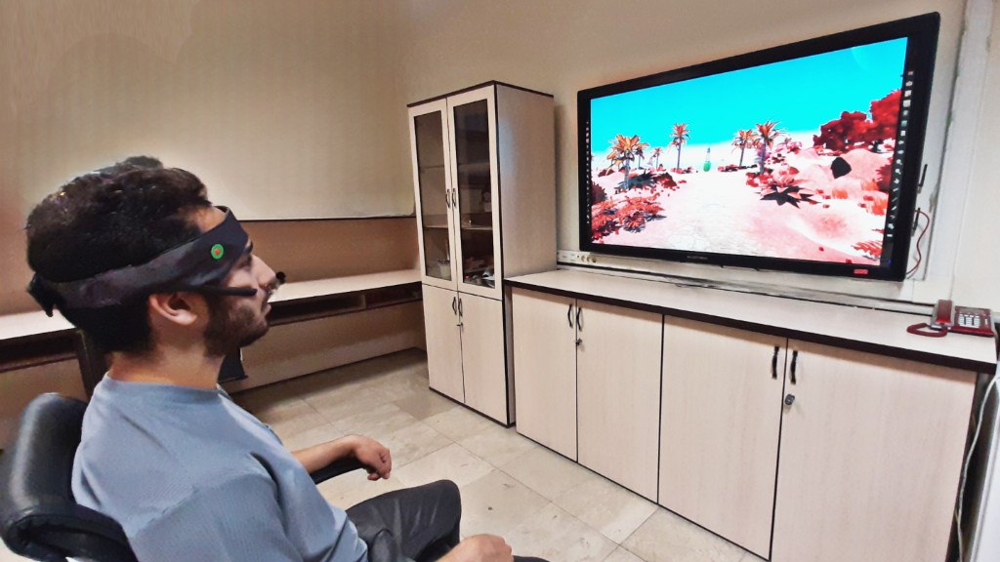
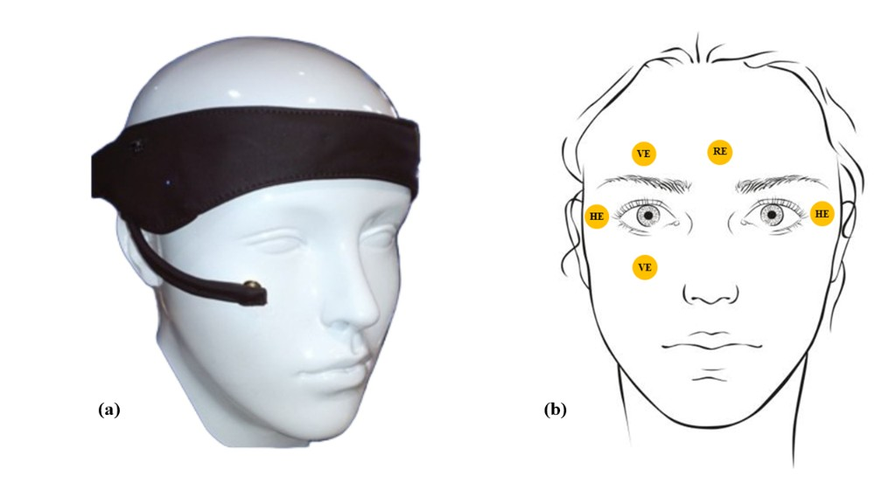

# Electrooculography Dataset for Objective Spatial Navigation Assessment in Healthy Participants During the Leiden Navigation Test

[DOI](https://doi.org/10.6084/m9.figshare.27156459)
[Data Descriptor](https://doi.org/10.1038/s41597-025-04879-z)
[License: CC BY 4.0](https://creativecommons.org/licenses/by/4.0/)

A curated electrooculography (EOG) dataset from **27 healthy young adults** recorded during the video-watching phase of the [Leiden Navigation Test (LNT)](https://doi.org/10.1038/s41598-020-60302-0). The dataset includes horizontal and vertical eye-movement signals, extracted oculomotor features, and behavioral scores from the Mini-Mental State Examination (MMSE) and Wayfinding Questionnaire (WQ).

This repository mirrors the dataset published on [Figshare](https://doi.org/10.6084/m9.figshare.27156459) and is described in detail in our *[Scientific Data](https://doi.org/10.1038/s41597-025-04879-z)* data descriptor article.

**Corresponding author:** Mehdi Delrobaei — [delrobaei@kntu.ac.ir](mailto:delrobaei@kntu.ac.ir) · [Biomechatronics Laboratory](https://wp.kntu.ac.ir/delrobaei/)

<p align="center">
  
  <br><em>Experimental setup: EOG recording during the LNT video-watching phase (<a href="https://doi.org/10.1038/s41597-025-04879-z">Zibandehpoor et al., 2025</a>).</em>
</p>

---

## Overview

Eye movements provide insight into how humans process spatial information, navigate environments, and allocate visual attention. This dataset was collected to support research linking **oculomotor behavior** with **spatial navigation** and **cognitive function** using a portable, wireless EOG headband.

**Key features:**

- Dual-channel EOG (horizontal and vertical) at **250 Hz** during LNT video viewing
- **27 participants** (14 male, 13 female; mean age 21.78 ± 1.59 years)
- Demographics, MMSE, WQ, and LNT image-questionnaire scores
- Pre-extracted blink, saccade, and fixation features per participant
- Event label signals for blinks, saccades, and fixations
- Companion MATLAB analysis code available in a separate repository

---

## Citation

If you use this dataset, please cite both the **data descriptor article** and the **dataset record**:

### Data descriptor (recommended primary citation)

> Zibandehpoor, M., Alizadehziri, F., Larki, A. A., Teymouri, S. & Delrobaei, M. Electrooculography Dataset for Objective Spatial Navigation Assessment in Healthy Participants. *Scientific Data* **12**, 553 (2025). [https://doi.org/10.1038/s41597-025-04879-z](https://doi.org/10.1038/s41597-025-04879-z)

### Dataset record

> Zibandehpoor, M., Alizadehziri, F., Larki, A. A., Teymouri, S. & Delrobaei, M. Electrooculography dataset for objective spatial navigation assessment in healthy subjects during the Leiden Navigation Test (Version 3) [Dataset]. Figshare. [https://doi.org/10.6084/m9.figshare.27156459](https://doi.org/10.6084/m9.figshare.27156459) (2025).

### BibTeX

```bibtex
@article{zibandehpoor2025eog,
  title   = {Electrooculography Dataset for Objective Spatial Navigation Assessment in Healthy Participants},
  author  = {Zibandehpoor, Mobina and Alizadehziri, Fatemeh and Larki, Arash Abbasi and Teymouri, Sobhan and Delrobaei, Mehdi},
  journal = {Scientific Data},
  volume  = {12},
  pages   = {553},
  year    = {2025},
  doi     = {10.1038/s41597-025-04879-z}
}

@dataset{zibandehpoor2025eogdata,
  title     = {Electrooculography dataset for objective spatial navigation assessment in healthy subjects during the Leiden Navigation Test},
  author    = {Zibandehpoor, Mobina and Alizadehziri, Fatemeh and Larki, Arash Abbasi and Teymouri, Sobhan and Delrobaei, Mehdi},
  year      = {2025},
  publisher = {Figshare},
  version   = {3},
  doi       = {10.6084/m9.figshare.27156459}
}
```

---

## Related resources


| Resource                                 | Link                                                                                                                                         |
| ---------------------------------------- | -------------------------------------------------------------------------------------------------------------------------------------------- |
| Figshare dataset (Version 3)             | [https://doi.org/10.6084/m9.figshare.27156459](https://doi.org/10.6084/m9.figshare.27156459)                                                 |
| *Scientific Data* data descriptor        | [https://doi.org/10.1038/s41597-025-04879-z](https://doi.org/10.1038/s41597-025-04879-z)                                                     |
| EOG eye-movement analysis code           | [https://github.com/abbrash/Eye-Movement-Analysis-Algorithm-Using-EOG](https://github.com/abbrash/Eye-Movement-Analysis-Algorithm-Using-EOG) |
| Persian Wayfinding Questionnaire (arXiv) | [https://doi.org/10.48550/arXiv.2412.02143](https://doi.org/10.48550/arXiv.2412.02143)                                                       |
| Biomechatronics Laboratory               | [https://wp.kntu.ac.ir/delrobaei/](https://wp.kntu.ac.ir/delrobaei/)                                                                         |


---

## Study design

### Participants

Thirty-two healthy university students were initially recruited. After signal-quality screening, **five participants were excluded** due to anomalies in vertical or horizontal EOG recordings. The final dataset contains **27 de-identified participants** with no reported visual impairments or neurological conditions. Participants who required corrective lenses wore them during testing.

### Protocol

1. Informed consent and assignment of a unique participant ID
2. Completion of the Persian-adapted **Wayfinding Questionnaire (WQ)**
3. Administration of the **Mini-Mental State Examination (MMSE)**
4. Fitting of a wireless dual-channel EOG headband (Zehnafzar Rayan Co., Isfahan, Iran)
5. Viewing of the **LNT animated navigation video** while EOG was recorded
6. Completion of the **LNT image-based questionnaire**

Participants were seated **2.15 m** from a 46-inch monitor. EOG was recorded via Bluetooth using dedicated MATLAB software (R2023b).

### Recording specifications


| Parameter          | Value                                                          |
| ------------------ | -------------------------------------------------------------- |
| Sampling rate      | 250 Hz                                                         |
| Voltage range      | ±2.4 V                                                         |
| ADC resolution     | 24 bit                                                         |
| Channels           | Vertical (B) and horizontal (A)                                |
| On-board filtering | High-pass 0.05 Hz; low-pass 20 Hz                              |
| Electrode type     | Gold cup (5 electrodes: 2 horizontal, 2 vertical, 1 reference) |

<p align="center">
  
  <br><em>Figure 1 — (a) Headband placement. (b) Electrode layout: VE = vertical, HE = horizontal, RE = reference.</em>
</p>

---

## Repository structure

```
.
├── README.md
├── LICENSE
├── CITATION.cff
├── docs/
│   └── figures/
│       ├── fig1_eog_headband_electrodes.png
│       ├── fig2_experimental_setup.png
│       └── fig3_data_folder_structure.png
└── Data/
    ├── Dataset.csv
    ├── LNT Image Questionnaire Answers.csv
    └── EOG Data/
        ├── Raw Data/
        │   ├── P_01.mat
        │   ├── P_02.mat
        │   └── ... (P_03 – P_27)
        └── Signals Features/
            ├── P_01/
            ├── P_02/
            └── ... (P_03 – P_27)
```

  
*Figure 3 — Overview of the dataset folder structure and file contents.*

### `Data/Dataset.csv`

Participant-level summary table (27 rows) including:


| Column                            | Description                            | Range / codes                  |
| --------------------------------- | -------------------------------------- | ------------------------------ |
| `ID Number`                       | De-identified participant ID           | 1 – 27                         |
| `Gender`                          | Sex                                    | M = Male, F = Female           |
| `Age`                             | Age in years                           | 19 – 25                        |
| `Education`                       | Education level                        | B = Bachelor, M = Master       |
| `MMSE score`                      | Mini-Mental State Examination total    | 0 – 30 (all participants > 27) |
| `Navigation and orientation (WQ)` | WQ subscale                            | 11 – 77                        |
| `Distance estimation (WQ)`        | WQ subscale                            | 3 – 21                         |
| `Spatial anxiety (WQ)`            | WQ subscale (reversed scoring)         | 8 – 56                         |
| `Landmark Recognition (LNT)`      | LNT subscore                           | 0 – 8                          |
| `Path survey (LNT)`               | LNT subscore                           | 0 – 4                          |
| `Location Allocentric (LNT)`      | LNT subscore                           | 0 – 4                          |
| `Path route (LNT)`                | LNT subscore                           | 0 – 4                          |
| `blink_num`                       | Total number of blinks                 | —                              |
| `concat_sacc_num`                 | Number of concatenated saccades        | —                              |
| `concat_sacc_SumDuration`         | Sum of concatenated saccade durations  | seconds                        |
| `concat_sacc_MeanDuration`        | Mean concatenated saccade duration     | seconds                        |
| `concat_fix_num`                  | Number of concatenated fixations       | —                              |
| `concat_fix_SumDuration`          | Sum of concatenated fixation durations | seconds                        |
| `concat_fix_MeanDuration`         | Mean concatenated fixation duration    | seconds                        |


> **Note:** The LNT egocentric-location subscore was excluded from the published dataset due to a translation issue during Persian adaptation. See the data descriptor for details.

### `Data/LNT Image Questionnaire Answers.csv`

Item-level responses to the LNT image questionnaire for all participants, including the correct answer key in the first row.

### `Data/EOG Data/Raw Data/`

MATLAB `.mat` files named `P_XX.mat` (one per participant). Each file contains:


| Variable | Description           |
| -------- | --------------------- |
| `A`      | Horizontal EOG signal |
| `B`      | Vertical EOG signal   |


Signal length matches the duration of the LNT video segment.

**MATLAB example:**

```matlab
load('Data/EOG Data/Raw Data/P_01.mat');
% A = horizontal channel, B = vertical channel
plot(A); hold on; plot(B); legend('Horizontal', 'Vertical');
```

### `Data/EOG Data/Signals Features/P_XX/`

Per-participant CSV files with extracted oculomotor metrics:


| File prefix                      | Metrics                                                  |
| -------------------------------- | -------------------------------------------------------- |
| `blinks_*`                       | Blink count (`num`), amplitude (`amp`), duration (`dur`) |
| `sacc_hor_*` / `sacc_ver_*`      | Horizontal / vertical saccade count, amplitude, duration |
| `fix_hor_*` / `fix_ver_*`        | Horizontal / vertical fixation count and duration        |
| `sacc_concat_*` / `fix_concat_*` | Concatenated saccade / fixation metrics                  |
| `label_sig.csv`                  | Sample-wise event labels for the recording               |


#### Label signal encoding (`label_sig.csv`)


| Value | Event               |
| ----- | ------------------- |
| 0     | Unknown / ambiguous |
| 1     | Fixation            |
| 2     | Saccade             |
| 3     | Blink               |


Labels were generated using the signal-processing pipeline described in the data descriptor and implemented in the [companion analysis repository](https://github.com/abbrash/Eye-Movement-Analysis-Algorithm-Using-EOG).

---

## Intended use

This dataset is intended for research on:

- Spatial navigation and wayfinding behavior
- Relationships between eye movements and cognitive assessment scores
- EOG-based oculomotor event detection and validation
- Comparison of portable EOG with optical eye-tracking approaches
- Development of assistive or diagnostic tools for navigation-related deficits

---

## License

This dataset is released under the [Creative Commons Attribution 4.0 International License (CC BY 4.0)](https://creativecommons.org/licenses/by/4.0/). You are free to share and adapt the data for any purpose, provided you give appropriate credit, link to the license, and indicate if changes were made.

The accompanying data descriptor article in *Scientific Data* is published under [CC BY-NC-ND 4.0](https://creativecommons.org/licenses/by-nc-nd/4.0/).

See [LICENSE](LICENSE) for the full dataset license text.

---

## Acknowledgements

We gratefully acknowledge all study participants. Data were collected in the Mechatronics Laboratory, K. N. Toosi University of Technology, Tehran, Iran.

---

## Changelog


| Version | Date       | Notes                    |
| ------- | ---------- | ------------------------ |
| 3       | 2025-02-22 | Current Figshare release |
| 1       | 2024-10-04 | First online release     |


For the authoritative version history, see [Figshare](https://doi.org/10.6084/m9.figshare.27156459).